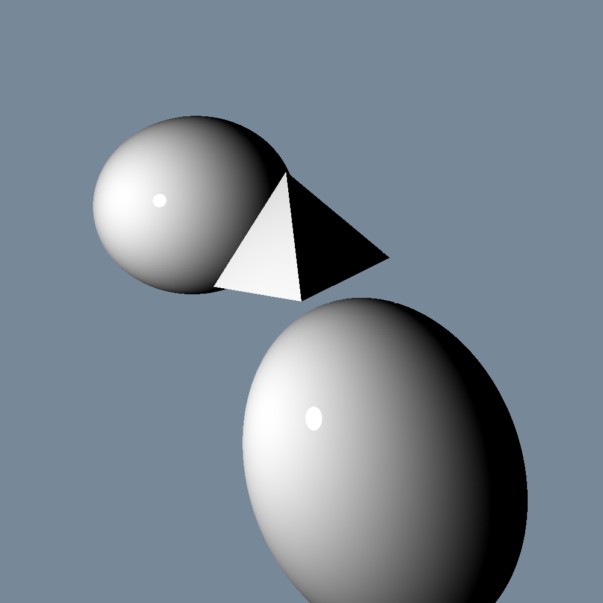
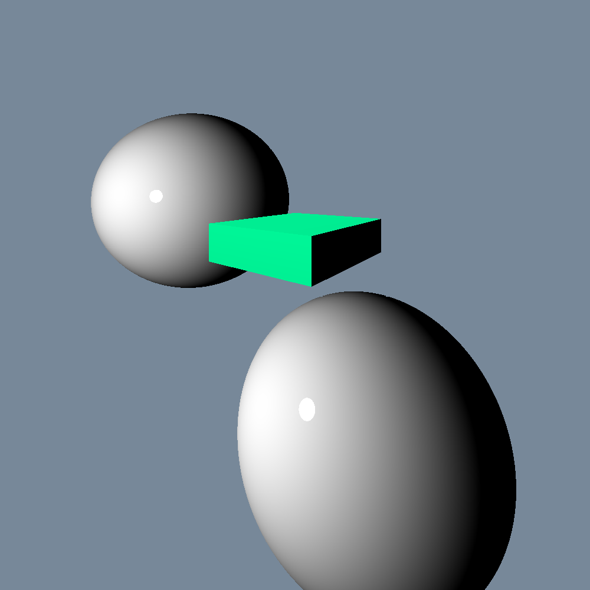

# Задача на расчёт лучей (18я в списке)

В данной задаче требуется для определённых фигур в арифметическом пространстве спроектировать освещение. Всего есть три типа фигуры:
1. Сфера
2. Параллелепипед, стороны которого параллельны осям координат
3. Тетраэдр

  Для начала нужно построить экран как множество точек, каждой из которых дано положение в пространстве(пространственные координаты) и телесные(пиксельные координаты).
Начало луч берёт в точке(будем называть её камерой), задаваемой пользователем. Сам экран задаётся расстоянием от камеры до его центра(т.к. экран считаем прямоугольным, то его центр - пересечение диагоналей),
угла обзора и количеством пикселей по вертикали.
  Фигуры могут пересекаться(коллизии нет). Каждую фигуру задаём опрелелённым образом: сферу с помощью центра и радиуса, параллелепипед максимальной и минимальной точками(переделаю, чтобы любыми
двумя противоположными), тетераэдр - произвольными четырьмя точками.

Примеры работы программы:
### Пример 1

### Пример 2

Компиляция: g++/clang++ -fopenmp -Wall *.cpp -o hell.exe -lgdi32 -fopenmp
